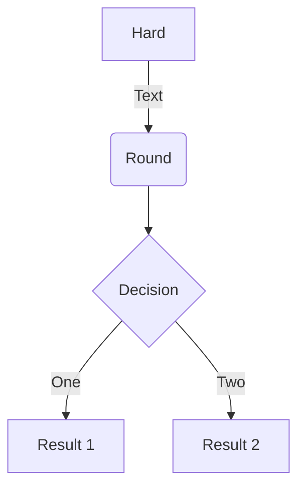
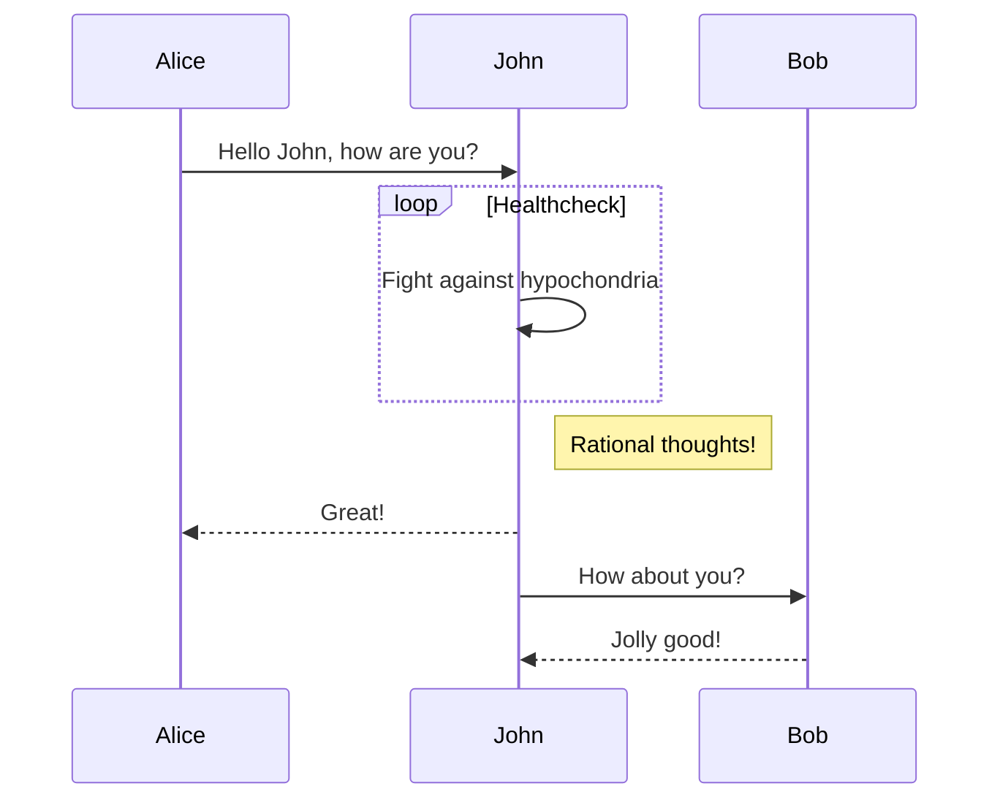
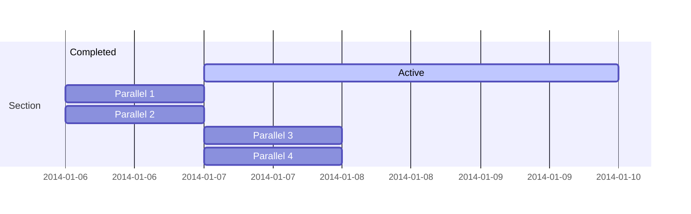
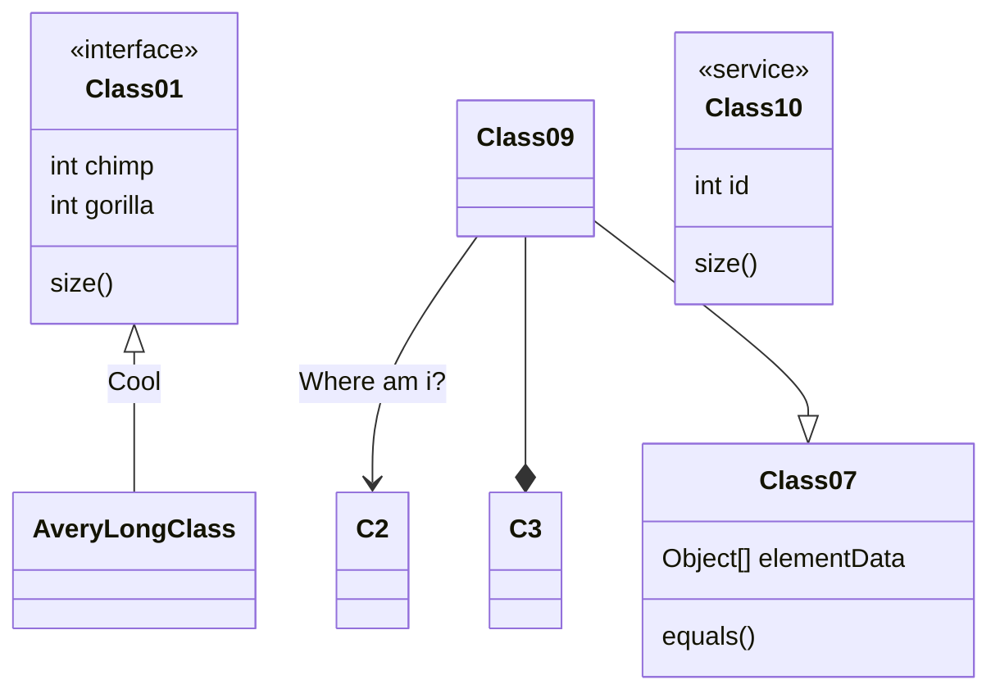
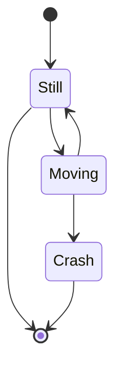

I am attempting to create a `Mapper-Reducer implementation` using basic features of Python and use `Multi-threading` (explained later) to run parallel reducer operations. I used google colab to run the model and you can find the required ["Pride_and_Prejudice.txt"](https://github.com/VipanchiKatthula/Mapper_Reducer_Implementation) file here.

### Input File
```python
inputfile = open('/content/drive/My Drive/IDS561BigData/Assignment1/Pride_and_Prejudice.txt',"r")
text = inputfile.read()
```

### Defining data cleaning function
```
def data_clean(text):
  NoNumbers = ''.join([i for i in text if not i.isdigit()]) #Removing numbers
  NoNumbers = text.lower()                                  #Making the text to lower case
  import re
  onlyText = re.sub(r"[^a-z\s]+",' ',NoNumbers)             #Removing punctuation
  finaltext = "".join([s for s in onlyText.strip().splitlines(True) if s.strip()]) #Removing the null lines
  return finaltext
```

renders as

```python
import pandas as pd
data = pd.read_csv("data.csv")
data.head()
```

### Math

Academic supports a Markdown extension for $\LaTeX$ math. You can enable this feature by toggling the `math` option in your `config/_default/params.toml` file.

To render *inline* or *block* math, wrap your LaTeX math with `$...$` or `$$...$$`, respectively.

Example **math block**:

```tex
$$\gamma_{n} = \frac{ 
\left | \left (\mathbf x_{n} - \mathbf x_{n-1} \right )^T 
\left [\nabla F (\mathbf x_{n}) - \nabla F (\mathbf x_{n-1}) \right ] \right |}
{\left \|\nabla F(\mathbf{x}_{n}) - \nabla F(\mathbf{x}_{n-1}) \right \|^2}$$
```

renders as

$$\gamma_{n} = \frac{ \left | \left (\mathbf x_{n} - \mathbf x_{n-1} \right )^T \left [\nabla F (\mathbf x_{n}) - \nabla F (\mathbf x_{n-1}) \right ] \right |}{\left \|\nabla F(\mathbf{x}_{n}) - \nabla F(\mathbf{x}_{n-1}) \right \|^2}$$

Example **inline math** `$\nabla F(\mathbf{x}_{n})$` renders as $\nabla F(\mathbf{x}_{n})$.

Example **multi-line math** using the `\\` math linebreak:

```tex
$$f(k;p_0^*) = \begin{cases} p_0^* & \text{if }k=1, \\
1-p_0^* & \text {if }k=0.\end{cases}$$
```

renders as

$$f(k;p_0^*) = \begin{cases} p_0^* & \text{if }k=1, \\
1-p_0^* & \text {if }k=0.\end{cases}$$

### Diagrams

Academic supports a Markdown extension for diagrams. You can enable this feature by toggling the `diagram` option in your `config/_default/params.toml` file or by adding `diagram: true` to your page front matter.

An example **flowchart**:

    ```mermaid
    graph TD
    A[Hard] -->|Text| B(Round)
    B --> C{Decision}
    C -->|One| D[Result 1]
    C -->|Two| E[Result 2]
    ```

renders as



An example **sequence diagram**:

    ```mermaid
    sequenceDiagram
    Alice->>John: Hello John, how are you?
    loop Healthcheck
        John->>John: Fight against hypochondria
    end
    Note right of John: Rational thoughts!
    John-->>Alice: Great!
    John->>Bob: How about you?
    Bob-->>John: Jolly good!
    ```

renders as



An example **Gantt diagram**:

    ```mermaid
    gantt
    section Section
    Completed :done,    des1, 2014-01-06,2014-01-08
    Active        :active,  des2, 2014-01-07, 3d
    Parallel 1   :         des3, after des1, 1d
    Parallel 2   :         des4, after des1, 1d
    Parallel 3   :         des5, after des3, 1d
    Parallel 4   :         des6, after des4, 1d
    ```

renders as



An example **class diagram**:

    ```mermaid
    classDiagram
    Class01 <|-- AveryLongClass : Cool
    <<interface>> Class01
    Class09 --> C2 : Where am i?
    Class09 --* C3
    Class09 --|> Class07
    Class07 : equals()
    Class07 : Object[] elementData
    Class01 : size()
    Class01 : int chimp
    Class01 : int gorilla
    class Class10 {
      <<service>>
      int id
      size()
    }
    ```

renders as



An example **state diagram**:

    ```mermaid
    stateDiagram
    [*] --> Still
    Still --> [*]
    Still --> Moving
    Moving --> Still
    Moving --> Crash
    Crash --> [*]
    ```

renders as



### Todo lists

You can even write your todo lists in Academic too:

```markdown
- [x] Write math example
- [x] Write diagram example
- [ ] Do something else
```

renders as

- [x] Write math example
- [x] Write diagram example
- [ ] Do something else

### Tables

Represent your data in tables:

```markdown
| First Header  | Second Header |
| ------------- | ------------- |
| Content Cell  | Content Cell  |
| Content Cell  | Content Cell  |
```

renders as

| First Header  | Second Header |
| ------------- | ------------- |
| Content Cell  | Content Cell  |
| Content Cell  | Content Cell  |

### Asides

Academic supports a [shortcode for asides](https://sourcethemes.com/academic/docs/writing-markdown-latex/#alerts), also referred to as *notices*, *hints*, or *alerts*. By wrapping a paragraph in `{} ... {}`, it will render as an aside.

```markdown
{}
A Markdown aside is useful for displaying notices, hints, or definitions to your readers.
{}
```

renders as

{}
A Markdown aside is useful for displaying notices, hints, or definitions to your readers.
{}

### Icons

Academic enables you to use a wide range of [icons from _Font Awesome_ and _Academicons_](https://sourcethemes.com/academic/docs/page-builder/#icons) in addition to [emojis](https://sourcethemes.com/academic/docs/writing-markdown-latex/#emojis).

Here are some examples using the `icon` shortcode to render icons:

```markdown
 Terminal  
 Python  
 R
```

renders as

 Terminal  
 Python  
 R

### Did you find this page helpful? Consider sharing it 🙌
