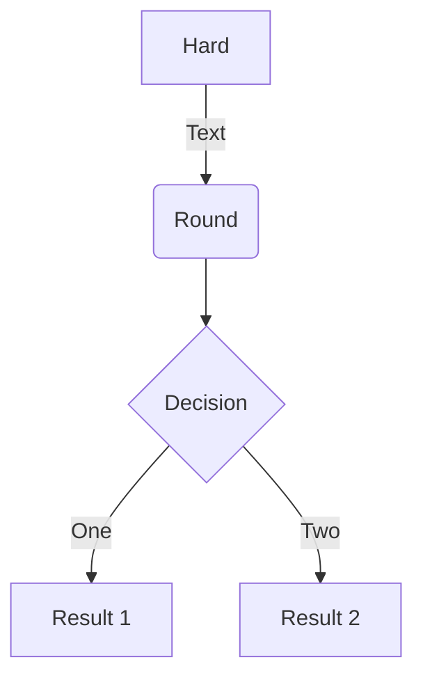
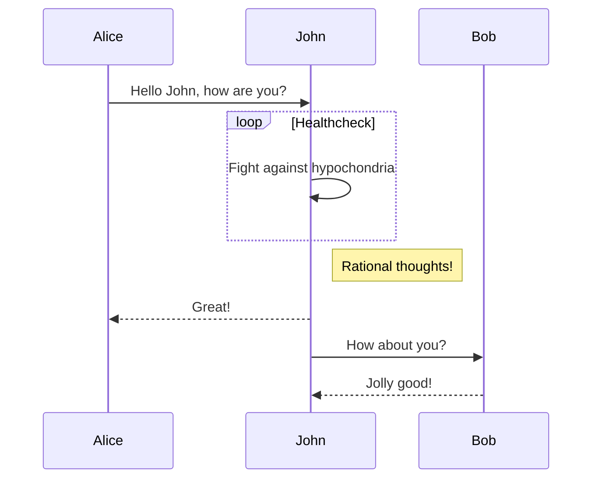
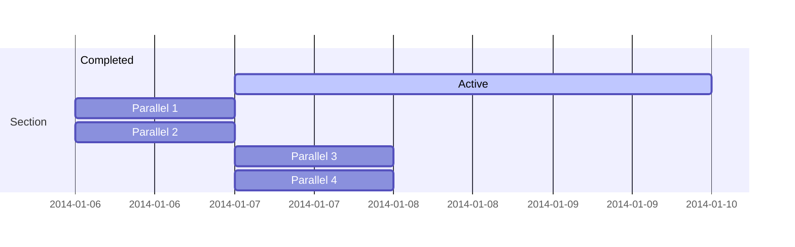
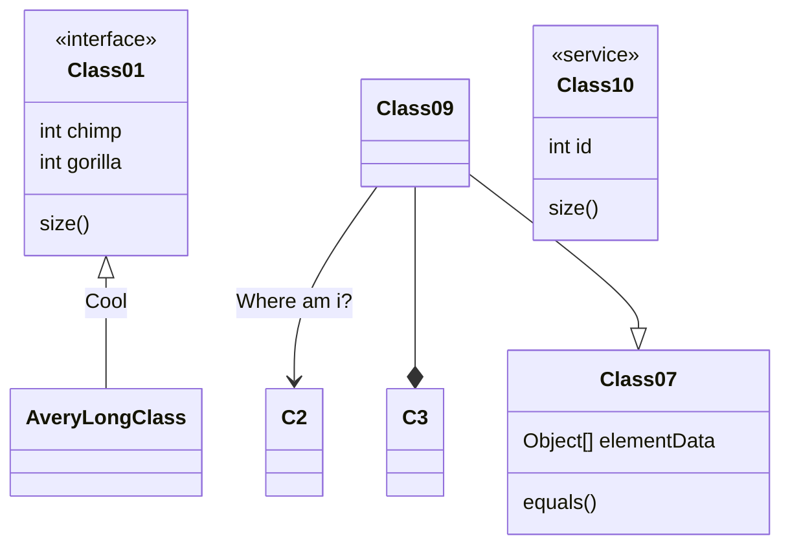
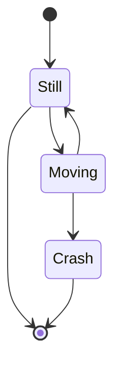

I  created a `Mapper-Reducer implementation` using basic features of Python to mimic Hadoop's mapper-reducer functionality. I used `Multi-threading` (explained later) to run parallel operations. I used Google Colab to run the model and you can find the required ["Pride_and_Prejudice.txt"] file [here](https://github.com/VipanchiKatthula/Mapper_Reducer_Implementation).

## Goal

First, let's map the words in the provided text to 1 using the mapper as `<Word,1>` and then use reducer to find the word count in the format `<Word,Count>`. A reducer also sorts the words which needs to be separately added to the series of operations. I implement the multi threading in python to parallelly get the word counts from two lists of words.

### Input File

```python
inputfile = open('/content/drive/My Drive/IDS561BigData/Assignment1/Pride_and_Prejudice.txt',"r")
text = inputfile.read()
```

### Data cleaning

In order for us to use the text from the book, we have to remove the the punctuations, unnecessary  numbers as they won't help us understand the text in most cases. 

We remove the numbers, convert the text to lower case using `.lower()` command and use Regular Expressions to replace punctuations with a space `' '` . I then remove those Lines with no text in them.

```
def data_clean(text):
  NoNumbers = ''.join([i for i in text if not i.isdigit()]) #Removing numbers
  NoNumbers = text.lower()                                  #Making the text to lower case
  import re
  onlyText = re.sub(r"[^a-z\s]+",' ',NoNumbers)             #Removing punctuation
  finaltext = "".join([s for s in onlyText.strip().splitlines(True) if s.strip()]) #Removing the null lines
  return finaltext
```

### Splitting data into two parts

Let's define a reusable function which takes a list of words as input to do multi-threading on the given data set. Here "a" is the number of words after you wish to make the split. For example, `splitlines(text,200)` will split the text into split1 and split2 as two sentences with first 1 to 199 words in split1 and rest in split2.

```
def splitlines(text,a):
  linessplit = text.splitlines() #Splitting the lines into a list
  split1 = linessplit[0:a]       #Creating the first split with the first "a" number of lines into split 1
  split2 = linessplit[a:]        #Creating the second split with the first "a" number of lines into split 2
  return split1,split2
```

### Mapper 


```
def mapper(text,out_queue):
  keyval = []
  for i in text:
    wordssplit = i.split()
    for j in wordssplit:
      keyval.append([j,1])      #Appending each word in the line with 1 and storing it in ["word",1] format in a nested list
  out_queue.put(keyval)
```


### Sorting Function


```
def sortedlists(list1,list2):
  out = list1 + list2             #Appending the two input lists into a single list
  out.sort(key= lambda x :x[0])   #Sorting the lists based on the first element of the list which is the "word"
  return out
```


### Partition 


```
def partition(sorted_list) :
 sort1out = []
 sort2out = []
 for i in sorted_list:
    if i[0][0] < 'n':             #Partitioning the sorted word list into two separate lists 
      sort1out.append(i)          #with first list containing words starting with a-m and n-z into second
    else : sort2out.append(i)
 return sort1out,sort2out
```

### Reducer


```
def reducer(part_out1,out_queue) :
  sum_reduced = []
  count = 1
  for i in range(0,len(part_out1)):
    if i < len(part_out1)-1:
      if part_out1[i] == part_out1[i+1]:
       count = count+1                              #Counting the number of words
      else : 
       sum_reduced.append([part_out1[i][0],count])  #Appending the word along with count to sum_reduced list as ["word",count]
       count = 1 
    else: sum_reduced.append(part_out1[i])          #Appending the last word to the output list    
  out_queue.put(sum_reduced)
```

### Multi - Threading function

The user defined function below takes a function and two inputs as arguments. The function is applied on both the inputs simultaneously and the output is returned by the function.

```
import threading
import queue
def multi_thread_function(func,map1_input,map2_input):  #func is the function to be used with two threads taking two inputs map1_input and map2_input
  my_queue1 = queue.Queue()  #Using queue to store the values of mapper output to use them in sort function
  my_queue2 = queue.Queue()
  t1 = threading.Thread(target=func, args=(map1_input,my_queue1)) 
  t2 = threading.Thread(target=func, args=(map2_input,my_queue2))  
  t1.start()                 #Starting the execution of thread1
  t2.start()                 #Starting the execution of thread2 to run simultaneously with thread1
  t1.join()                  #Waiting for the thread1 to be completely executed
  t2.join()                  #Waiting for the thread2 to be completely executed
  list1out = my_queue1.get() #Getting the values from the queue into a variable to return its value
  list2out = my_queue2.get()
  return list1out,list2out
```

### Mapper-Reducer

Finally, we combine all the above functions to split the lines after 5000 words and them implement the entire Mapper Reducer operation which mimics the way Hadoop's handles the data.

```
def main_function(text):  
  cleantext = data_clean(text)
  linessplit = splitlines(cleantext,5000)
  mapperout = multi_thread_function(mapper,linessplit[0],linessplit[1]) 
  sortedwords = sortedlists(mapperout[0],mapperout[1])
  slicedwords = partition(sortedwords)
  reducerout = multi_thread_function(reducer,slicedwords[0],slicedwords[1])
  return reducerout[0]+reducerout[1]

output = main_function(text)
import pandas as pd
pd.DataFrame(output).to_csv("Output.csv",index=False,header = ["Word","Frequency"]) #Saving file as a .csv file in the current directory
```


### Math

Academic supports a Markdown extension for $\LaTeX$ math. You can enable this feature by toggling the `math` option in your `config/_default/params.toml` file.

To render *inline* or *block* math, wrap your LaTeX math with `$...$` or `$$...$$`, respectively.

Example **math block**:

```tex
$$\gamma_{n} = \frac{ 
\left | \left (\mathbf x_{n} - \mathbf x_{n-1} \right )^T 
\left [\nabla F (\mathbf x_{n}) - \nabla F (\mathbf x_{n-1}) \right ] \right |}
{\left \|\nabla F(\mathbf{x}_{n}) - \nabla F(\mathbf{x}_{n-1}) \right \|^2}$$
```

renders as

$$\gamma_{n} = \frac{ \left | \left (\mathbf x_{n} - \mathbf x_{n-1} \right )^T \left [\nabla F (\mathbf x_{n}) - \nabla F (\mathbf x_{n-1}) \right ] \right |}{\left \|\nabla F(\mathbf{x}_{n}) - \nabla F(\mathbf{x}_{n-1}) \right \|^2}$$

Example **inline math** `$\nabla F(\mathbf{x}_{n})$` renders as $\nabla F(\mathbf{x}_{n})$.

Example **multi-line math** using the `\\` math linebreak:

```tex
$$f(k;p_0^*) = \begin{cases} p_0^* & \text{if }k=1, \\
1-p_0^* & \text {if }k=0.\end{cases}$$
```

renders as

$$f(k;p_0^*) = \begin{cases} p_0^* & \text{if }k=1, \\
1-p_0^* & \text {if }k=0.\end{cases}$$

### Diagrams

Academic supports a Markdown extension for diagrams. You can enable this feature by toggling the `diagram` option in your `config/_default/params.toml` file or by adding `diagram: true` to your page front matter.

An example **flowchart**:

    ```mermaid
    graph TD
    A[Hard] -->|Text| B(Round)
    B --> C{Decision}
    C -->|One| D[Result 1]
    C -->|Two| E[Result 2]
    ```

renders as



An example **sequence diagram**:

    ```mermaid
    sequenceDiagram
    Alice->>John: Hello John, how are you?
    loop Healthcheck
        John->>John: Fight against hypochondria
    end
    Note right of John: Rational thoughts!
    John-->>Alice: Great!
    John->>Bob: How about you?
    Bob-->>John: Jolly good!
    ```

renders as



An example **Gantt diagram**:

    ```mermaid
    gantt
    section Section
    Completed :done,    des1, 2014-01-06,2014-01-08
    Active        :active,  des2, 2014-01-07, 3d
    Parallel 1   :         des3, after des1, 1d
    Parallel 2   :         des4, after des1, 1d
    Parallel 3   :         des5, after des3, 1d
    Parallel 4   :         des6, after des4, 1d
    ```

renders as



An example **class diagram**:

    ```mermaid
    classDiagram
    Class01 <|-- AveryLongClass : Cool
    <<interface>> Class01
    Class09 --> C2 : Where am i?
    Class09 --* C3
    Class09 --|> Class07
    Class07 : equals()
    Class07 : Object[] elementData
    Class01 : size()
    Class01 : int chimp
    Class01 : int gorilla
    class Class10 {
      <<service>>
      int id
      size()
    }
    ```

renders as



An example **state diagram**:

    ```mermaid
    stateDiagram
    [*] --> Still
    Still --> [*]
    Still --> Moving
    Moving --> Still
    Moving --> Crash
    Crash --> [*]
    ```

renders as



### Todo lists

You can even write your todo lists in Academic too:

```markdown
- [x] Write math example
- [x] Write diagram example
- [ ] Do something else
```

renders as

- [x] Write math example
- [x] Write diagram example
- [ ] Do something else

### Tables

Represent your data in tables:

```markdown
| First Header  | Second Header |
| ------------- | ------------- |
| Content Cell  | Content Cell  |
| Content Cell  | Content Cell  |
```

renders as

| First Header  | Second Header |
| ------------- | ------------- |
| Content Cell  | Content Cell  |
| Content Cell  | Content Cell  |

### Asides

Academic supports a [shortcode for asides](https://sourcethemes.com/academic/docs/writing-markdown-latex/#alerts), also referred to as *notices*, *hints*, or *alerts*. By wrapping a paragraph in `{} ... {}`, it will render as an aside.

```markdown
{}
A Markdown aside is useful for displaying notices, hints, or definitions to your readers.
{}
```

renders as

{}
A Markdown aside is useful for displaying notices, hints, or definitions to your readers.
{}

### Icons

Academic enables you to use a wide range of [icons from _Font Awesome_ and _Academicons_](https://sourcethemes.com/academic/docs/page-builder/#icons) in addition to [emojis](https://sourcethemes.com/academic/docs/writing-markdown-latex/#emojis).

Here are some examples using the `icon` shortcode to render icons:

```markdown
 Terminal  
 Python  
 R
```

renders as

 Terminal  
 Python  
 R

### Did you find this page helpful? Consider sharing it 🙌
